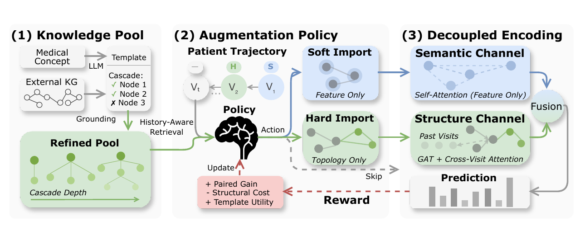

# Import What You Need: Learning When and How to Augment EHR Graphs with External Knowledge



</div>

ReTA (**Re**inforcement learning-based dynamic **T**opology **A**ugmentation)
learns whether, what, and how to import external knowledge at each visit in a
patient trajectory. Instead of expanding every EHR graph with the same
knowledge, ReTA selects a retrieved template and applies **Soft Import**,
**Hard Import**, or **Skip** according to the evolving patient state.


## Method Map

The implementation follows the same sequence as the paper method:

| Paper stage                         | Implementation                                               | Responsibility                                               |
| ----------------------------------- | ------------------------------------------------------------ | ------------------------------------------------------------ |
| **Visit Graph Construction (§2.1)** | [`reta/data/`](reta/data)                                    | Normalize ICD codes, map ICD to CCS, aggregate 24-hour visits, and construct visit graphs |
| **Knowledge Pool (§2.2)**           | [`distill.py`](reta/knowledge/distill.py), [`filtering.py`](reta/knowledge/filtering.py), [`clustering.py`](reta/knowledge/clustering.py), [`pool.py`](reta/knowledge/pool.py) | Validate, ground, filter, cluster, and retrieve knowledge templates |
| **Augmentation Policy (§2.3)**      | [`policy.py`](reta/learning/policy.py), [`runtime.py`](reta/learning/runtime.py), [`rl_train.py`](reta/learning/rl_train.py) | Build policy states, select Soft/Hard/Skip actions, compute paired rewards, and optimize with REINFORCE |
| **Decoupled Encoding (§2.4)**       | [`model.py`](reta/learning/model.py)                         | Encode semantic and structural views, apply augmentation, fuse both channels, and predict CCS categories |
| **Two-Stage Training (§2.5)**       | [`warmup.py`](reta/learning/warmup.py), [`rl_train.py`](reta/learning/rl_train.py), [`reta.yaml`](configs/reta.yaml) | Warm up the encoder, then refine the policy and live encoder |
| **Evaluation (§3)**                 | [`inference.py`](reta/learning/inference.py), [`results/`](results), [`logs/`](logs) | Validate checkpoint contracts, evaluate diagnosis prediction, and store reference results |

Supporting release contracts live in
[`reta/knowledge/releases/pool_v1/`](reta/knowledge/releases/pool_v1), and the
test suite is in [`tests/`](tests).

## Quick Start

### Install

Dependencies are pinned in
[`requirements.txt`](requirements.txt).

```bash
git clone https://github.com/ChenC2002/ReTA.git
cd ReTA
python3.11 -m venv .venv
source .venv/bin/activate
python -m pip install -e .
```

### Validate

The repository includes a versioned pool specification and a one-template,
four-dimensional example for validation only:

```bash
reta validate-pool-release
reta validate-template-pool \
  --templates_jsonl examples/tiny_templates.jsonl \
  --expected_dim 4
python tests/test_smoke.py
```

Run the full test suite with:

```bash
python -m unittest discover -s tests -p 'test*.py'
```

## Required Inputs

Full runs require credentialed MIMIC-III or MIMIC-IV diagnosis data, ICD-to-CCS
mappings, a CCS hierarchy, PrimeKG or UMLS-derived resources, and externally
generated concept-level distillation responses. 

### EHR Files

| Input                   | Required format                                              |
| ----------------------- | ------------------------------------------------------------ |
| Diagnosis events        | CSV with `patient_id,timestamp,icd_code`; add `icd_version` for mixed ICD-9/10 data |
| ICD-to-CCS mapping      | CSV with `icd,ccs`; add `icd_version` for a versioned mapping |
| Preprocessing hierarchy | CSV with `child,parent`                                      |

### Knowledge Files

| Input                  | Required format                                              |
| ---------------------- | ------------------------------------------------------------ |
| Concept inventory      | CSV with `concept_id,concept_name` and optional `density` (`sparse`, `moderate`, or `dense`) |
| Distillation responses | JSONL with exactly `definition` and `clinical_cascade`, one response per concept in matching row order |
| Biomedical inventory   | CSV with `entity_id,name` and optional `source`              |
| Embedding candidates   | Optional CSV/JSONL with `mention,entity_id,score`            |
| PrimeKG support        | CSV with `u,v` and optional `relation`                       |
| CCS filtering support  | CSV with `parent,child`                                      |

The preprocessing and filtering hierarchy files use opposite column orders.
Do not reuse one file for both stages without reorienting its columns.

## Workflow

### Step 1: Preprocess

The preprocessor treats `timestamp` as an event time and creates fixed 24-hour
windows anchored at each patient's first valid event.

```bash
python -m reta.data.preprocess \
  --events data/raw/diagnoses.csv \
  --icd2ccs data/resources/icd_to_ccs.csv \
  --ccs_hierarchy data/resources/ccs_hierarchy.csv \
  --out_dir data/processed \
  --h_anc 2
```

For mixed ICD-9/10 input, include an `icd_version` column in both files and
append `--icd_version_col icd_version` and
`--mapping_icd_version_col icd_version` to the command.


- `data/processed/processed.pt`, containing vocabularies and patient
  trajectories; and
- `data/processed/splits.json`, containing deterministic, patient-disjoint
  train/validation/test identifiers.

### Step 2: Build the Pool

The versioned prompts, schemas, thresholds, and pinned model revision are in
[`reta/knowledge/releases/pool_v1`](reta/knowledge/releases/pool_v1). Generate
one schema-valid response per concept outside this repository, then validate
and serialize those responses. The command below performs no LLM request and
stores no API credentials.

```bash
python -m reta.knowledge.distill \
  --concepts_csv data/resources/concepts.csv \
  --responses_jsonl data/resources/distillation_responses.jsonl \
  --model_family GPT-4o \
  --out_jsonl data/knowledge/artifacts.jsonl
```

Ground mentions and retain only externally supported relations:

```bash
python -m reta.knowledge.filtering \
  --artifacts-jsonl data/knowledge/artifacts.jsonl \
  --inventory-csv data/resources/inventory.csv \
  --embedding-candidates data/resources/clinicalbert_top1.csv \
  --primekg-edges-csv data/resources/primekg_edges.csv \
  --ccs-edges-csv data/resources/ccs_support_edges.csv \
  --out-grounded-jsonl data/knowledge/grounded.jsonl \
  --out-audit-jsonl results/filtering_audit.jsonl \
  --out-summary-json results/filtering_summary.json
```

Filtering uses precomputed embedding candidates and performs no model download.
Clustering loads the exact Bio_ClinicalBERT revision recorded in `pool_v1` and
may download it if it is not already cached:

```bash
python -m reta.knowledge.clustering \
  --grounded_jsonl data/knowledge/grounded.jsonl \
  --out_jsonl data/knowledge/templates.jsonl \
  --tau 0.16 \
  --projection_dim 256
```

Validate the pool and assign stable token IDs to external medoid-subgraph nodes
that are not already in the processed ICD/CCS vocabulary:

```bash
reta validate-template-pool \
  --templates_jsonl data/knowledge/templates.jsonl \
  --expected_dim 256

reta build-entity-map \
  --processed_path data/processed/processed.pt \
  --templates_jsonl data/knowledge/templates.jsonl \
  --out data/resources/entity_to_token.json
```

### Step 3: Train

Review [`configs/reta.yaml`](configs/reta.yaml) before training. Its defaults
match the main paper settings where implemented, including `K = 20`, model
dimension 256, two GNN layers, four attention heads, 30 warm-up epochs, and 50
RL iterations.

```bash
python -m reta.learning.warmup --config configs/reta.yaml
python -m reta.learning.rl_train \
  --config configs/reta.yaml \
  --warmup_ckpt checkpoints/warmup.pt
```

Stage 1 writes `checkpoints/warmup.pt`. Stage 2 requires that checkpoint and
writes `checkpoints/rl_iterN.pt` after every iteration. The training scripts use
one `torch.device`; multi-GPU and multi-seed orchestration are not included.

### Step 4: Evaluate

Inference checks the processed data, split, template pool, vocabulary, entity
mapping, and model fingerprints against the checkpoint contract. Greedy policy
actions are used by default.

```bash
python -m reta.learning.inference \
  --checkpoint checkpoints/rl_iter50.pt \
  --processed_path data/processed/processed.pt \
  --templates_jsonl data/knowledge/templates.jsonl \
  --entity_to_token_json data/resources/entity_to_token.json \
  --split_json data/processed/splits.json \
  --split test \
  --out results/inference.json
```

Add `--max_patients 10` for a small checkpoint-backed evaluation. Add
`--include-sample-metadata` to record action metadata keyed by run-local patient
indices. A Hard Import that cannot attach any new structure is recorded as a
no-op rather than as a successful structural edit.

Local inference reports `AUPRC_micro`, `MicroF1@0.5`, and `Acc@20` on the
`[0, 1]` scale. The released paper artifacts store metrics in percentage
points.

## Outputs

Paper-reported numbers are included as synchronized reference artifacts in
[`results/paper_results.json`](results/paper_results.json) and
[`logs/paper_results.jsonl`](logs/paper_results.jsonl). The runnable pipeline
does not regenerate every record in these files.

| Output                                       | Path                                                         |
| -------------------------------------------- | ------------------------------------------------------------ |
| Paper reference results                      | `results/paper_results.json`, `logs/paper_results.jsonl`     |
| Distilled, grounded, and clustered knowledge | `data/knowledge/{artifacts,grounded,templates}.jsonl`        |
| Filtering diagnostics                        | `results/filtering_audit.jsonl`, `results/filtering_summary.json` |
| Training checkpoints                         | `checkpoints/warmup.pt`, `checkpoints/rl_iter*.pt`           |
| Local diagnosis evaluation                   | `results/inference.json`                                     |
| Runtime logs                                 | `logs/warmup.log`, `logs/rl_train.log`, `logs/inference.log` |

Generated clinical-data derivatives, mappings, checkpoints, local results, and
runtime logs are ignored by Git. `processed.pt` uses PyTorch serialization, so
load only locally generated or otherwise trusted processed data. Checkpoints
use restricted tensor-only loading and are bound to their runtime contracts.
